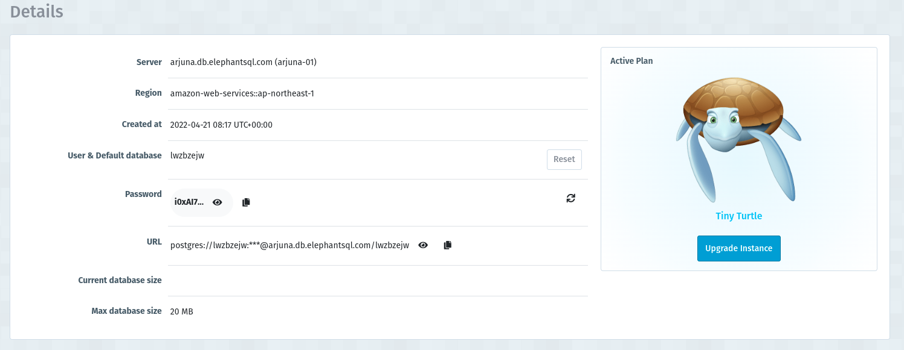

# Go x Database

## Connect to Database
Before we can execute SQL command to database, we must connected to DB first. To create connection, there are something we need to prepare:
1. Prepare DB connection credential (user, pass, host, db name, etc)
2. Prepare driver
3. Ensure DB network is accessible
4. Conect to DB, using the credential and with suitable drivers

### DB Connection Credential
If you already follow `Database Introduction` tutorial, you should have created PostgreSQl instance using `elephantsql.com`, you can get your DB credential on instance detail

```
host/server    : arjuna.db.elephantsql.com
username       : lwzbzejw
database name  : lwzbzejw
password       : i0xAI7 ...
port           : 5432 (using default port)
```

### DB Driver
In Go we can use 3rd party package that provide driver for different DBMS
- MySQL -> github.com/go-sql-driver/mysql
- PostgreSQL -> github.com/lib/pq

We can install the package using `go get <package-name>`

after we download it we can import it to our code 
```go
import (
  "database/sql" 
  _ "github.com/lib/pq"
)
```

Package `database/sql` will help us on creating connection and make interaction with database

### Accessing Databsae
```go
package main

import (
  "database/sql" 
  _ "github.com/lib/pq"
  "fmt"
  "log"
)

const (
  host     = "arjuna.db.elephantsql.com"
  port     = 5432
  user     = "lwzbzejw"
  password = "i0xAI..."
  dbname   = "lwzbzejw"
)

func main() {

  psqlInfo := fmt.Sprintf("host=%s port=%d user=%s "+
    "password=%s dbname=%s sslmode=disable",
    host, port, user, password, dbname)

  db, err := sql.Open("postgres", psqlInfo)
  if err != nil {
    log.Fatal(err)
  } else {
    fmt.Println("database connected")
  }
  
  defer db.Close()
}
```
- `sql.Open` used to start connection to database
- Its need 2 arguments, `driverName`and `dataSourceName`. We will need connection string for the dataSourceName
<br> more about [connection string](https://en.wikipedia.org/wiki/Connection_string)
- `db.Close` will be used for close database connection


## Retrieving Result
```go
var (
  id int
  name string
)

rows, err := db.Query("select id, name from users where id = 1")

if err != nil {
  log.Fatal(err)
}
defer rows.Close()

for rows.Next() {
  err := rows.Scan(&id, &name)
  if err != nil {
    log.Fatal(err)
  }

  log.Println(id, name)
}

err = rows.Err()

if err != nil {
     log.Fatal(err)
}
```
-`db.Query()` used for send Query to database
- Do iteration for the next row using `rows.Next()`
- `rows.Scan` used to read data each row and assign it to variable
- check error after the iteration

```go
err = db.QueryRow("...").Scan(&name)

if err != nil {
  log.Fatal(er)
}

fmt.Println(name)
```
- `db.QueryRow()` used for query that return only one row
- we can chained it with `Scan()` (method chaining) to get and parsing the value to variable at once.

## Prepare Query Statement
```go
stmt, err := db.Prepare("select id, name from users where id =?")

if err != nil {
  log.Fatal(err)
}

defer stmt.Close()

rows, err := stmt.Query(1)

if err != nil {
  log.Fatal(err)
}

defer rows.Close() 

for rows.Next() {

}

if err = rows.Err(); err != nil {
  log.Fatal(err)
}
```
- if we want to use query that will be executed more than once, we can use `db.Prepare()`, it will return the query sstatement that we can use
- can be use with `Query()` or `QueryRow()`
- can prevent [SQL injection](https://medium.com/pujanggateknologi/prepared-statement-di-go-927b1a8863ec)

## Insert, Update, Delete with Exec()
```go
stmt, err := db.Prepare("insert into users(name) values(?)")

if err != nil {
  log.Fatal(err)
}

res, err := stmt.Exec("Jhony")

if err != nil {
  log.fatal(err)
}
```
- `.Exec()` can be use for inser, update, and delete
- we can use `Exec()` and `db.Prepare()` for reusable statement and prevent SQL injection


## Transaction
```go
tx, err := db.Begin()

if err != nil {
  log.Fatal(err)
}

defer tx.Rollback

stmt, err := tx.Prepare ("insert into foo values(?)")

if err != nil {
  log.Fatal(err)
}

defer stmt.Close()

for i := 0; i < 10; i++ {
  _, err = stmt.Exec(i)
  if err != nil {
    log.Fatal(err)
  }
}

err = tx.Commit()

if err != nil {
  log.Fatal(err)
}
```

- `tx.Begin` used for start the transaction
- `tx.Rollback` used for undo the transaction
- `tx.Commit` used for finish the transaction, in this state data can't be rollback to the orginal

## Assignment
1. Try insert new student with name `John Doe` , gender `M`
2. Update student Id 2 name, with `Marie`
3. Delete student id 1
4. Don't forget to handle the error